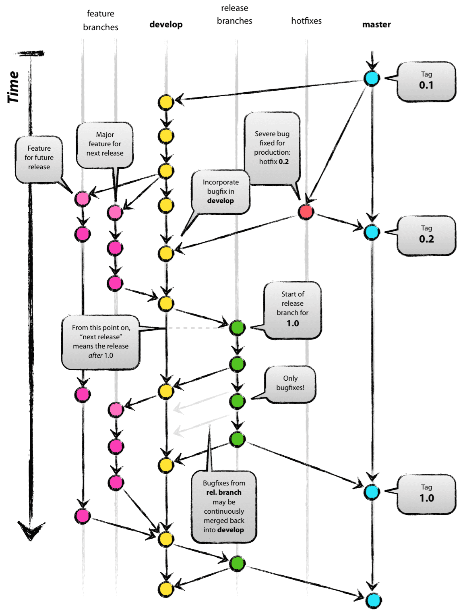

# Git Flow イメージと各ブランチの役割

git-flow とは、[Vincent Driessen](https://github.com/nvie) が、ブログに書いた [A successful Git branching model](https://nvie.com/posts/a-successful-git-branching-model/) というブランチモデルをもとにした、git を拡張したプラグインのことある。

ここではプラグインの説明はせず、git-flow ブランチモデルのイメージと各ブランチの役割の概要のみを押さえておく。

  

## 各ブランチの役割  

### master:  

プロダクトとしてリリースするためのブランチ。リリースしたらタグ付けする。

### develop:  

開発ブランチ。コードが安定し、リリース準備ができたら master へマージする。リリース前はこのブランチが最新バージョンとなる。

### feature branches:  

機能の追加。 develop から分岐し、 develop にマージする。

### hotfixes:  

リリース後のクリティカルなバグフィックスなど、 現在のプロダクトのバージョンに対する変更用。 master から分岐し、 master にマージし、タグをつける。次に develop にマージする。

### release branches:  

プロダクトリリースの準備。 機能の追加やマイナーなバグフィックスとは独立させることで、 リリース時に含めるコードを綺麗な状態に保つ（機能追加中で未使用のコードなどを含まないようにする）ことができる。 

develop ブランチにリリース予定の機能やバグフィックスがほぼ反映した状態で develop から分岐する。 リリース準備が整ったら、 master にマージし、タグをつける。次に develop にマージする。
  
