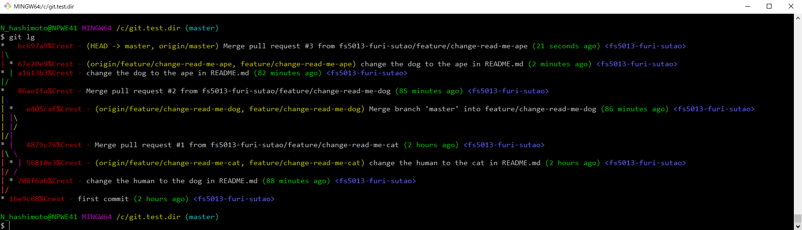

# config ファイルにエイリアスを登録する方法

毎回長いオプションを打たなくても、短いコマンドで済むように、コマンドにエイリアス（別名）を登録する機能が git にある。
ここでは、このエイリアスを登録する手順を確かめてみる。

例として、git のログを見やすく表示してくれるコマンドを「lg」として登録する。

## git ログの表示コマンドを登録する

以下のように git config コマンドを使って、ローカルの config ファイルにエイリアスを登録してみる。

```console
git config --local alias.lg "log --graph --pretty=format:'%Cred%h%Creset -%C(yellow)%d%Creset %s %Cgreen(%cr) %C(bold blue)<%an>%Creset' --abbrev-commit --date=relative"
```

ローカルリポジトリの config ファイルに追記できているか確認する。

```console
cat ./.git/config
```

‪C:\git.test.dir\.git\config
```
[core]
        repositoryformatversion = 0
        filemode = false
        bare = false
        logallrefupdates = true
        symlinks = false
        ignorecase = true
[alias]
        lg = log --graph --pretty=format:'%Cred%h%Creset -%C(yellow)%d%Creset %s %Cgreen(%cr) %C(bold blue)<%an>%Creset' --abbrev-commit --date=relative

```

これで今、登録した `lg` コマンドが使えるはず。

```console
git lg
```

まだコミットされていない段階では、コミットがないよのメッセージが出る。

コミットがない場合の実行結果：
```
fatal: your current branch 'master' does not have any commits yet
```
  
コミットがある場合の実行結果：

  
