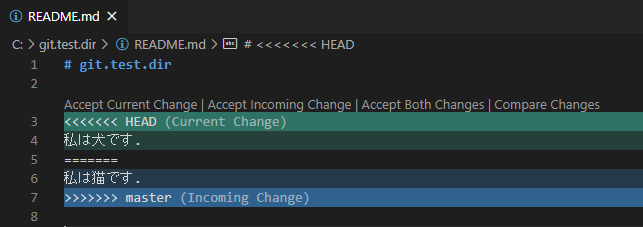

# section.02: master ブランチの保護とコンフリクトの解決

**NOTE:**  
> コマンドの実行環境は Windows 10 を想定
> 
> ※チュートリアル中で使われている git コマンド以外のコマンドの説明は以下のファイルを参照  
> [チュートリアル中で使った bash コマンドの説明](./explain_bash_command.md)  
  
## master ブランチを保護する  
```console
git branch
```

`* master` と表示され現在、master ブランチにいることが分かる。

ここで master ブランチの保護設定をしておく。

コンフリクトや不用意なバグの混入を防ぐために、実際の開発では master ブランチへのコミットを禁止している。

ただし、禁止ルールというだけでは、間違えて master にコミットしてしまうことは防げないので、以下の手順で master ブランチにコミットできないように、master ブランチの保護設定をしておく。

GitHub の Settings -> Branches -> Branch protection rules で Add rule ボタンを押下する。

Branch name pattern に master と入力。Include administrators（管理者を含む）のチェックボックスにはチェックを入れ、Create ボタンを押下することで、すべての push から master ブランチを保護することができる。

つまり以降、master ブランチへのコミットは不可能となる。  

## 新規 dog ブランチの作成
ここからローカルに戻る。 

```console
git checkout -b feature/change-read-me-dog 
git branch
```
実行結果：
```console
* feature/change-read-me-dog
  master
```

状況イメージ：
```
local
               feature/change-read-me-dog  
               B'  
              /  
master A-----B  
```

新規ブランチ `feature/change-read-me-dog` を切って、そのブランチに移動したことが分かる。
master ブランチに戻る。

```console
git checkout master
git branch
```
実行結果：
```console
  feature/change-read-me-dog
* master
```

現在地が master ブランチに戻ったことが分かる。

## 新規 cat ブランチの作成
```console
git checkout -b feature/change-read-me-cat
git branch
```
実行結果：
```console
* feature/change-read-me-cat
  feature/change-read-me-dog
  master
```

状況イメージ：
```
local
               feature/change-read-me-dog  
               B'  
              /  
master A-----B  
              \  
               B''  
               feature/change-read-me-cat  
```

さらに、新規ブランチ `feature/change-read-me-cat` を切って、そのブランチに移動したことが分かる。ここからは `feature/change-read-me-cat` ブランチ上で作業をする。 

`git push -u origin feature/change-read-me-c` まで入力し、Tab キーを押すことで、Git Bash ではブランチ名も補完が効くことを確認する。

```console
git push -u origin feature/change-read-me-cat 
```

このブランチを反映するコマンド、`git push -u origin <指定ブランチ>` は、上流に origin （origin は、デフォルトのリモートリポジトリのこと）を指定して、ブランチを反映する。

※ push の `-u` オプションは、`--set-upstream` オプションの略で、git pull する際の上流を指定するオプション 

状況イメージ：
```
origin
  
master A-----B  
              \  
               B''  
               feature/change-read-me-cat  
```
  
`feature/change-read-me-cat` ブランチをリモートに反映できたことを GitHub で確認する。

```console
cat ./README.md
sed -i 's/人間/猫/' ./README.md
cat ./README.md
```

README.md ファイル中の「人間」部分が「猫」に書き変わったことを確認する。

```console
git add .
git commit -m 'change the human to the cat in README.md'
git push
```
実行結果イメージ：
```
local
               feature/change-read-me-dog  
               B'  
              /  
master A-----B  
              \  
               B''---C  
               feature/change-read-me-cat  
```
```
origin
  
master A-----B  
              \  
               B''---C  
               feature/change-read-me-cat  
```

GitHub のリポジトリを見て、「Compare & pull request」のボタンが表示されていることを確認する。

ここで「Compare & pull request」ボタンを押下する。

差分が「人間」と「猫」部分であることを確認、マージ内容が「base:master <- compare:feature/change-read-me-cat」で Able to merge（マージ可能）となっていることを確認する。

コメント欄に「猫にしたので、コードレビューをお願いします」と入力し、Create pull request ボタンを押下する。

ここで `change the human to the cat in README.md` のコミットをクリック。

コードの差分を確認、「私は猫です」の行の「+」を押下して、出現するコメント欄に「猫への変更 OK です」と入力し Start a review ボタンを押下する。

Finish your review ボタンを押下し、Comment のラジオボタンが選択されていることを確認して、Submit review ボタンを押下。

画面でレビューが完了したことを確認して、Merge pull request ボタンを押下。

マージコメント欄に「change the human to the cat in README.md」が自動入力されたことを確認し、Confirm merge ボタンを押下する。

これでリモートでのマージが完了。
  
実行結果イメージ：
```
origin
  
master A-----B---------D
              \       /
               B''---C  
               feature/change-read-me-cat  
```
  
上部の Pull requests タブを押すと、`0 Open 1 Closed` となっていることを確認し、`1 Closed` をクリックする。

ここにプルリクエストの履歴が残っていることを確認する。

リポジトリのトップページを見て、README.md の内容が「猫」に変わっていることを確認するここからローカルに戻る。

```console
git branch
```

`feature/change-read-me-cat` ブランチにいることを確認する。

```console
git checkout master 
cat ./README.md
```

ローカルの master ブランチはまだ、README.md ファイルの内容が「人間」となっていることを確認する。

```console
git pull
cat ./README.md
```
実行結果イメージ：
```
local
               feature/change-read-me-dog  
               B'  
              /  
master A-----B---------D
              \       /
               B''---C  
               feature/change-read-me-cat  
```

pull によって、リモートでマージされた内容がローカルリポジトリに反映され、README.md の内容が「猫」になっていることを確認する。

```console
git checkout feature/change-read-me-dog
git branch
```

`feature/change-read-me-dog` ブランチに移動したことを確認する。

```console
git branch -a
```

リモートにはまだ、`feature/change-read-me-dog` が反映されていないことを確認する。

```console
git push -u origin feature/change-read-me-dog  
git branch -a
```
実行結果イメージ：
```
origin
               feature/change-read-me-dog  
               B'  
              /  
master A-----B---------D
              \       /
               B''---C  
               feature/change-read-me-cat  
```

ブランチがリモートに反映できたことを確認する。

```console
cat ./README.md
```

master が「猫」でマージされる前にブランチを切ったので、まだ内容が「人間」となっていることを確認する。

```console
sed -i 's/人間/犬/' ./README.md
cat ./README.md
```

「犬」に書き変わったことを確認する。

```console
git add .
git commit -m 'change the human to the dog in README.md'
git push
```
実行結果イメージ：
```
origin
               feature/change-read-me-dog  
               B'----------E   
              /  
master A-----B---------D
              \       /
               B''---C  
               feature/change-read-me-cat  
```
  
GitHub のリポジトリを見て、「Compare & pull request」のボタンが表示されていることを確認するここで「Compare & pull request」ボタンを押下。
  
状況イメージ：
```
origin
               feature/change-read-me-dog  
               B'----------E   
              /             \
master A-----B---------D---- Can’t automatically merge. 
              \       /
               B''---C  
               feature/change-read-me-cat  
```

Can’t automatically merge. となっていて、自動マージができないことを確認する。

原因は、「人間」を「猫」に書き換えたものと「犬」に書き換えたものが同一箇所にあり、どちらを反映したら良いか自動判定できない状態になっていることです。

一度ローカルに戻る。

```console
git branch
```

`feature/change-read-me-dog` ブランチにいることが分かる。

```console
git merge master 
```
実行結果：
```
Auto-merging README.md
CONFLICT (content): Merge conflict in README.md
Automatic merge failed; fix conflicts and then commit the result.
```
日本語訳：
```
README.md を自動マージ 
内容がコンフリクトしています： README.md のマージで競合
自動マージに失敗しました。コンフリクトを修正してから結果をコミットしてください。
```
実行結果イメージ：
```
local
               feature/change-read-me-dog  
               B'----E----@ CONFLICT.Automatic merge failed.  
              /          /   
master A-----B----------D  
              \        /
               B''----C  
               feature/change-read-me-cat  
```

master ブランチの内容を `feature/change-read-me-dog` ブランチにマージした（取り込んだ）が、もちろん内容が競合（コンフリクト）した状態になる。

VSCode で README.md ファイルを見てみる。

コンフリクト部分：
＝＝＝＝＝
```console
<<<<<<< HEAD
私は犬です.  
=======
私は猫です.  
>>>>>>> master
```
＝＝＝＝＝

確かに機械的にどちらの変更が正しいかは自動的には判定できない。

では今回は、開発の要件上、後で変更した「犬」が最終的な変更とすることにする。

そこで VSCode 上で、コンフリクト部分に出現している Accept Current Change ボタンを押下して、最新の変更を採用し、ファイルを保存する。

  

```console
git add ./README.md
git commit
```

vi エディタが開くので、コンフリクトのコミットメッセージが出力されていることを画面で確認できれば、「:q」と入力して、コンフリクトのコミットメッセージをそのまま生かしてコミットを完了させる。

```console
git push
```
実行結果イメージ：
```
origin:local
               feature/change-read-me-dog  
               B'----E----F 
              /          /   
master A-----B----------D  
              \        /
               B''----C  
               feature/change-read-me-cat  
```

これで GitHub を見て、コミットが Able to merge になったことを確認する。  
  
プルリクエスト画面では、コメント欄に「コンフリクトを解決し、『犬』に変更したのでレビューをお願いします」と入力して Create pull request ボタンを押下する。  
  
変更内容が「犬」であることを確認し、Merge pull request ボタンを押下。  
  
マージコメント欄に「Feature/change read me dog」が自動入力されたことを確認し、Confirm merge ボタンを押下する。  
  
実行結果イメージ：
```
origin
               feature/change-read-me-dog  
               B'----E----F 
              /          / \  
master A-----B----------D---G  
              \        /
               B''----C  
               feature/change-read-me-cat  
```
  
リポジトリのトップページを見て、README.md の内容が「犬」に変わっていることを確認する。  
ここからローカルに戻る。  
  
最終章 section.03 につづく・・・  
[section.03: 誤ったコミットの解決とスタッシュ ](section.03.md)  
  
